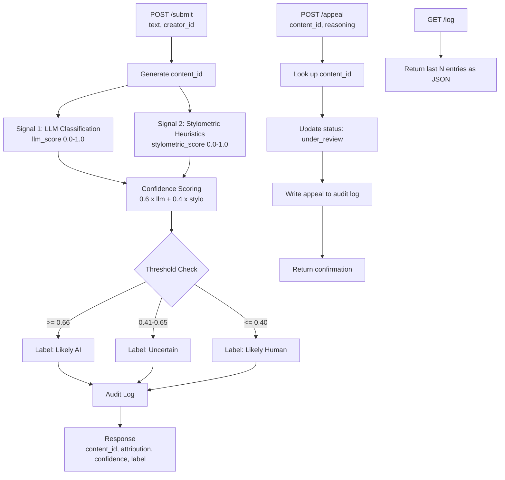

# Provenance Guard — planning.md

> Written before implementation. Updated before any stretch features.

---

## Overview

Provenance Guard is a backend API for a Love Island fan forum where users post
recaps, reactions, hot takes, and fan theories. The platform wants to surface
transparency labels on submitted posts so readers know whether content was written
by a real fan or generated by AI. A false positive (labeling a real fan's post as
AI) is worse than a false negative — the label design and confidence scoring
reflect that asymmetry.

---

## Architecture Narrative

A submitted post travels through the following path:

1. Creator submits text via POST /submit
2. Signal 1 (LLM) reads the text and returns a score (0–1) for AI likelihood
3. Signal 2 (stylometrics) computes statistical properties and returns a score (0–1)
4. Both scores are combined into a single confidence score
5. The confidence score maps to one of three transparency labels
6. The decision is written to the audit log
7. The response is returned to the creator with content_id, attribution, confidence, and label

For appeals:
1. Creator submits POST /appeal with content_id and their reasoning
2. System updates the content status to "under_review"
3. Appeal is logged alongside the original decision
4. Confirmation is returned to the creator

---

## Detection Signals

### Signal 1: LLM Classification (Groq)

**What it measures:** Semantic and stylistic coherence. The LLM reads the post
holistically and assesses whether it reads like a real fan wrote it — informal
language, personal opinions, slang, emotional reactions — or whether it reads
like AI output — overly structured, generic, balanced tone, no personality.

**Output:** A float between 0.0 and 1.0 where 1.0 = highly likely AI-generated
and 0.0 = highly likely human-written.

**What it misses:** A very articulate fan who writes formally might score high.
A prompt-injected input designed to fool the LLM could score low. The LLM also
has no memory of prior posts so it can't detect patterns across submissions.

---

### Signal 2: Stylometric Heuristics (Pure Python)

**What it measures:** Statistical properties of the text that differ between
human and AI writing. AI text tends to be more uniform and consistent; human
writing is messier and more variable. Specifically:

- **Sentence length variance:** AI sentences tend to be similar lengths.
  Human writing has more variation — short punchy sentences mixed with long ones.
- **Type-token ratio (TTR):** Vocabulary diversity. Calculated as unique words /
  total words. AI text reuses vocabulary in predictable patterns.
- **Punctuation density:** Human fan posts use exclamation marks, ellipses,
  question marks emotionally. AI text uses punctuation more sparingly and evenly.

**Output:** A float between 0.0 and 1.0 where 1.0 = statistically consistent
with AI writing and 0.0 = statistically consistent with human writing.

**What it misses:** Short posts don't have enough text for statistical signals
to be meaningful. A non-native English speaker writing formally might score high
on AI likelihood even though they're human.

---

## Confidence Scoring

Both signals are combined into a single confidence score using a weighted average:

confidence = (0.6 * llm_score) + (0.4 * stylometric_score)

The LLM signal gets more weight because it captures semantic meaning, which is
more informative than surface statistics for this type of content.

**Score thresholds:**
- 0.0 – 0.40 → Likely human-written
- 0.41 – 0.65 → Uncertain
- 0.66 – 1.0 → Likely AI-generated

A score of 0.5 means the system genuinely cannot tell — both signals are giving
mixed information. This is different from a score of 0.9, which means both signals
strongly agree the content is AI-generated.

---

## Transparency Labels

### High-confidence AI (confidence >= 0.66)

⚠️ This post shows strong signs of AI generation.
The writing lacks the personality and spontaneity
we'd expect from a real Islander fan.

### Uncertain (confidence 0.41 – 0.65)

🤔 We're not sure about this one. It could go either way. Our system isn't confident enough to make a call.

### High-confidence human (confidence <= 0.40)
✅ This post reads as human-written — the chaos,
the slang, the passion. Verified fan energy.

---

## Appeals Workflow

**Who can appeal:** Any creator who submitted content via POST /submit.
They need their content_id (returned in the submit response).

**What they provide:**
- `content_id` (str): The ID of the submission they're contesting
- `creator_reasoning` (str): Their explanation for why the classification is wrong

**What the system does:**
1. Looks up the original submission by content_id
2. Updates its status from "classified" to "under_review"
3. Logs the appeal alongside the original decision in the audit log
4. Returns a confirmation message to the creator

**What a human reviewer would see:**
When reviewing the appeal queue (GET /log), they'd see the original submission
entry with the signal scores and confidence, plus the appeal entry with the
creator's reasoning and the updated status.

No automated re-classification is performed — a human makes the final call.

---

## Anticipated Edge Cases

**Edge case 1: Very short posts**
A post like "omg Casa Amor really said chaos 😭" is only 7 words. The stylometric
signal needs enough text to compute meaningful variance — short posts will produce
unreliable stylometric scores. The system should flag posts under ~20 words as
low-confidence by default.

**Edge case 2: Non-native English speakers writing formally**
A fan whose first language isn't English might write in a more structured, formal
style that triggers both signals toward AI. The system would misclassify them as
AI-generated even though they're a real person. This is exactly the false positive
scenario the appeals workflow is designed to handle.

**Edge case 3: AI-generated content written in deliberate fan slang**
Someone could prompt an LLM to write in Love Island slang and informal style.
This might fool the LLM signal. The stylometric signal might catch the unusual
uniformity, but it's not guaranteed. The system would return an uncertain label
rather than high-confidence human.

---

## API Endpoints

| Method | Endpoint | Purpose |
|--------|----------|---------|
| POST | /submit | Submit content for attribution analysis |
| POST | /appeal | Contest a classification decision |
| GET | /log | Return recent audit log entries |

**POST /submit accepts:**
```json
{
  "text": "string — the content to analyze",
  "creator_id": "string — identifier for the creator"
}
```

**POST /submit returns:**
```json
{
  "content_id": "string — unique ID for this submission",
  "attribution": "string — likely_ai | uncertain | likely_human",
  "confidence": 0.78,
  "label": "string — the transparency label text",
  "llm_score": 0.81,
  "stylometric_score": 0.72
}
```

**POST /appeal accepts:**
```json
{
  "content_id": "string — ID from the submit response",
  "creator_reasoning": "string — why the creator thinks the label is wrong"
}
```

---

## Architecture Diagram


---

## AI Tool Plan

**Milestone 3 — Submission endpoint + Signal 1:**
I'll give Claude the Detection Signals section (Signal 1 only), the API endpoints
section, and the Architecture diagram. I'll ask it to generate: the Flask app
skeleton with POST /submit stub, the LLM signal function, and a basic audit log
writer. I'll verify by calling the endpoint with a clearly AI-sounding input and
a clearly human-sounding input and checking that the llm_score differs meaningfully.

**Milestone 4 — Signal 2 + confidence scoring:**
I'll give Claude the Detection Signals section (Signal 2), the Confidence Scoring
section, and the Architecture diagram. I'll ask it to generate the stylometric
signal function and the scoring combination logic. I'll verify by testing the 4
sample inputs from the milestone instructions and checking that scores vary across
the full range (not clustered at one end).

**Milestone 5 — Production layer:**
I'll give Claude the Transparency Labels section, Appeals Workflow section, and
Architecture diagram. I'll ask it to generate the label generation function, the
POST /appeal endpoint, and Flask-Limiter setup. I'll verify by: triggering all
three label variants, submitting an appeal and checking GET /log shows
"under_review", and running 12 rapid requests to confirm 429s after the limit.